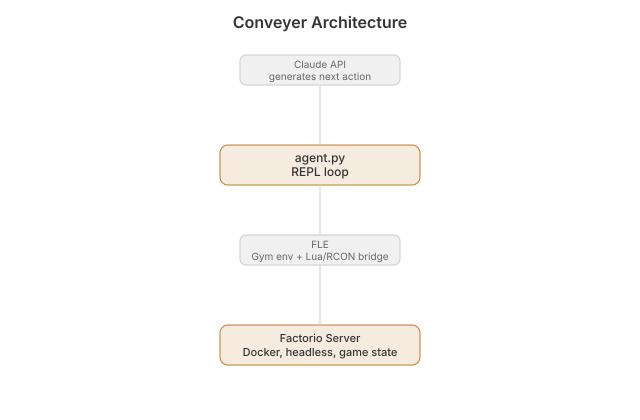

# Conveyor

  [](https://github.com/nulljosh/conveyor)

Claude plays Factorio.

Conveyor is an agent loop that puts Claude in control of a real Factorio game through the
game's own Lua mod API and RCON console — no pixels, no vision model, just full structured
game state (entities, inventories, recipes, research, logistics) in and Python code out.

It's built on [FLE](https://github.com/JackHopkins/factorio-learning-environment) (Factorio
Learning Environment), an existing open-source Gym-style environment that already solved the
hard plumbing: the Lua/RCON bridge, Docker orchestration of headless Factorio servers, and
structured observations. Conveyor is the agent loop on top: it feeds Claude the environment's
output as an observation, gets back a Python snippet as the next action, executes it, and
repeats.

## Status

Early scaffold. Architecture is decided; `agent.py` isn't written yet. See
[roadmap.md](roadmap.md).

## How it works



Each turn: Claude gets the stdout/stderr from the last action as its observation and returns
a Python snippet. `agent.py` sends that snippet into FLE, which runs it against the Lua/RCON
bridge inside the Factorio server container, and the result becomes the next observation.

## Setup

Requires:

- A licensed copy of Factorio (≥2.0.73).
- Docker Desktop — FLE runs the actual headless Factorio server(s) in containers it
  orchestrates itself. This is also the practical path on macOS, since Factorio's official
  headless binary is Linux-only.
- `ANTHROPIC_API_KEY` set — the agent loop calls Claude via the Anthropic API.

```bash
pip install factorio-learning-environment
```

## Develop

```bash
python3 agent.py          # run the agent loop against a local FLE cluster
```

(Not yet implemented — see [roadmap.md](roadmap.md).)

## Credit

Built on [FLE](https://github.com/JackHopkins/factorio-learning-environment)
(Hopkins, Bakler, Khan et al.) rather than a from-scratch RCON bridge — it already has the
task suite, benchmark harness, and native Anthropic support that would otherwise need
rebuilding.

## License

MIT 2026, Joshua Trommel. Factorio is property of Wube Software; this project is unaffiliated
and does not distribute the game.
