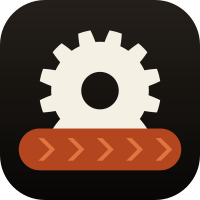
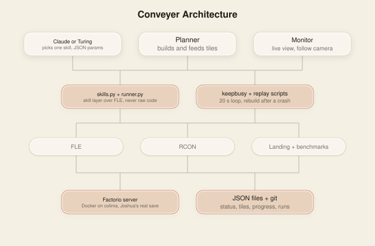

# Conveyer

  [](https://github.com/nulljosh/conveyer)

An LLM plays Factorio. On a real save.

It reads the game as data, not pixels. Each turn it picks one move from a short list. The move checks its own result, and the game answers. [Live](https://conveyer.heyitsmejosh.com).

Built on [FLE](https://github.com/JackHopkins/factorio-learning-environment), the Factorio Learning Environment.

## Where it is

<!-- progress:start -->
**Road to the rocket: 100%** `####################` 44 of 44 techs the silo needs. Rockets launched: 1 (v1.0, assisted: purple and yellow science were console-fed).
<!-- progress:end -->

Plays on a copy of a real 2,300 entity base. Red, green, blue and purple science are automated. v1.0 launched a rocket with a satellite, assisted: the purple and yellow packs for the last techs were console-fed, and the silo was placed by script. The honest next step is automating yellow science and the silo so a launch needs no help. [Roadmap](roadmap.md).


## Assisted launch, and what is next

v1.0.0 launched a rocket with a satellite, assisted. The labs were fed the last packs through the console and the silo was placed by script (`scripts/assist.py`, `scripts/silo.py`). Red through purple science ran on automated tiles. v2.0.0 is a launch with no help. The gap list is in [roadmap.md](roadmap.md), the training plan for a model of our own is in [docs/TRAINING.md](docs/TRAINING.md).

## Run it

You need a licensed Factorio (2.0.73 or newer), Docker, and a token from [factorio.com/profile](https://www.factorio.com/profile). On a Mac, use [colima](https://github.com/abiosoft/colima) and keep the repo under `$HOME`.

```bash
# .env: FACTORIO_USERNAME=... FACTORIO_TOKEN=...
pip install -r requirements.txt
set -a; source .env; set +a
fle cluster start -n 1 -s open_world
python3 runner.py --env-id open_play
./step.sh '{"skill": "inspect", "params": {}}'
```

## Your own save

`scripts/world.sh` boots the server on a copy of your save. The original is never touched. `scripts/world.sh back` returns to the test map. Then run `python3 runner.py --env-id open_play --keep-world`.

## Watch it

- **Menu bar and live window:** `menubar/build.sh`, then `ConveyerMonitor.app --open-live`. The live window floats above everything (Ctrl+Option+P toggles), follows the player, shows the real engineer sprite and a pulsing dot on every machine. Ctrl+Option+H shows or hides the progress panel.
- **Terminal:** `python3 scripts/tui.py`.
- **Screenshots and benchmark:** `scripts/snap.py` saves a frame and a row to `shots/` every 5 minutes. [docs/BENCHMARKS.md](docs/BENCHMARKS.md) and the graph above are regenerated from real data by a git pre-commit hook (`git config core.hooksPath .githooks`).
- **Your own Factorio client:** connect to the server address. The version must match exactly. Under colima, start it with `--network-address` so UDP works.

## How it works



`runner.py` stays alive and reads a skill from `runner_cmd.json`. `skills.py` turns it into code FLE runs against the server. The result comes back as the next observation. Details in [docs/ARCHITECTURE.md](docs/ARCHITECTURE.md). Lessons so far in [docs/LEARNINGS.md](docs/LEARNINGS.md).

## License

MIT 2026, Joshua Trommel. Factorio is property of Wube Software. This project is unaffiliated and does not distribute the game.
