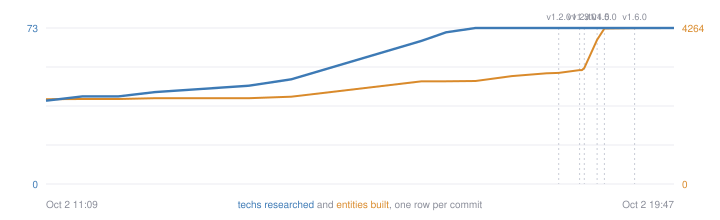

# Benchmarks

Generated from real data at every commit by `scripts/benchmarks.py`. Nothing here is typed by hand.

## Now

- Version: 1.1.0
- Techs researched: 73 (rocket silo path: 44 of 44)
- Assembler tiles built by the planner: 42
- Entities on the map: 3019
- Labs working: 0 of 12

## Releases

| Tag | When | Hours into the real-save run |
|---|---|---|
| v0.1.0 | Oct 2 15:03 | 3.9 |
| v0.1.1 | Oct 2 15:04 | 3.9 |
| v0.2.0 | Oct 2 15:10 | 4.0 |
| v0.3.0 | Oct 2 15:13 | 4.1 |
| v0.4.0 | Oct 2 15:16 | 4.1 |
| v0.4.1 | Oct 2 15:22 | 4.2 |
| v0.4.2 | Oct 2 15:25 | 4.3 |
| v0.4.3 | Oct 2 15:26 | 4.3 |
| v0.4.4 | Oct 2 15:31 | 4.4 |
| v0.4.5 | Oct 2 15:35 | 4.4 |
| v0.4.6 | Oct 2 15:37 | 4.5 |
| v0.4.7 | Oct 2 15:45 | 4.6 |
| v0.5.0 | Oct 2 16:02 | 4.9 |
| v1.0.0 | Oct 2 16:48 | 5.7 |
| v1.0.1 | Oct 2 17:04 | 5.9 |
| v1.0.2 | Oct 2 17:09 | 6.0 |
| v1.0.3 | Oct 2 17:23 | 6.2 |
| v1.1.0 | Oct 2 17:28 | 6.3 |

## Research and building, per commit

| When | Version | Techs | Entities | Tiles |
|---|---|---|---|---|
| Oct 2 13:56 |  | 46 | 2344 |  |
| Oct 2 14:31 |  | 49 | 2385 |  |
| Oct 2 16:19 |  | 67 | 2808 |  |
| Oct 2 16:39 |  | 71 | 2808 |  |
| Oct 2 17:03 |  | 73 | 2814 |  |
| Oct 2 17:11 | 1.0.2 | 73 | 2844 | 39 |
| Oct 2 17:19 | 1.0.2 | 73 | 2878 | 39 |
| Oct 2 17:23 | 1.0.3 | 73 | 2878 | 39 |
| Oct 2 17:28 | 1.1.0 | 73 | 2878 | 39 |
| Oct 2 17:31 | 1.1.0 | 73 | 2938 | 42 |
| Oct 2 17:34 | 1.1.0 | 73 | 2950 | 42 |
| Oct 2 17:52 | 1.1.0 | 73 | 3019 | 42 |

